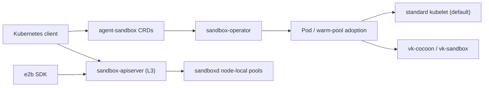

# sandbox-operator

A Kubernetes operator and aggregated apiserver for warm-poolable agent sandboxes,
using the [agent-sandbox](https://github.com/kubernetes-sigs/agent-sandbox) APIs.
It supports ordinary Pods and Cocoon microVM backends; pre-warmed CRD claims
measured **~33 ms at p50** on the microVM backend ([methodology](PERFORMANCE.md)).

**Documentation: [cocoonstack.github.io/sandbox-operator](https://cocoonstack.github.io/sandbox-operator/)**

## Architecture



- `Sandbox`, `SandboxTemplate`, `SandboxWarmPool` and `SandboxClaim` serve
  v1alpha1 and v1beta1, with v1beta1 as storage and conversion webhooks.
- The CRD path creates Pods or adopts pre-warmed Sandboxes from a named pool;
  an empty pool falls back to a cold start. The default claim policy cold-starts
  from its template.
- L3 serves reads from node inventory and routes mutations to sandboxd.
  Empty warm capacity returns `503`; inventory reads are eventually consistent.
  Its lifecycle subresources and optional e2b surface share the node-local store.

## Quick start

From a checkout of a published release tag, with access to a Kubernetes cluster:

```bash
helm upgrade --install sandbox-operator ./helm \
  --namespace sandbox-system --create-namespace \
  --set-string image.tag="$(git describe --tags --exact-match)"
kubectl -n sandbox-system rollout status deployment/sandbox-operator

kubectl apply -f - <<'YAML'
apiVersion: agents.x-k8s.io/v1beta1
kind: Sandbox
metadata:
  name: demo
  namespace: default
spec:
  podTemplate:
    spec:
      containers:
        - name: agent
          image: nginx:alpine
YAML
kubectl -n default wait --for=condition=Ready sandbox/demo --timeout=120s
```

This uses the portable standard-kubelet backend. MicroVM backends require
virtual nodes and an explicit runtime selection. See [runtime backends](docs/runtime-backends.md),
[Kubernetes client usage](docs/usage.md), and [installation options](docs/configuration.md#installation).
The aggregate server is a separate deployment; its flags and client setup are
in [e2b compatibility](docs/e2b-compat.md) and [lifecycle](docs/lifecycle.md).

## Related projects

- [agent-sandbox](https://github.com/kubernetes-sigs/agent-sandbox) — upstream API and controller source; see [provenance](UPSTREAM.md).
- [vk-cocoon](https://github.com/cocoonstack/vk-cocoon) — schedules Pod-backed Cocoon microVMs on virtual nodes.
- [vk-sandbox](https://github.com/cocoonstack/vk-sandbox) — connects Pod scheduling to sandboxd warm pools.
- [sandbox](https://github.com/cocoonstack/sandbox) — the node-local sandboxd runtime used by L3.

## Development

```bash
make build
make test
make lint
make fmt
```

## License

AGPL-3.0 — see [LICENSE](LICENSE). This fork uses AGPL for its operator and
runtime integration. Imported agent-sandbox APIs, controllers and conversion
webhooks retain their Apache-2.0 notices; see [UPSTREAM.md](UPSTREAM.md).
