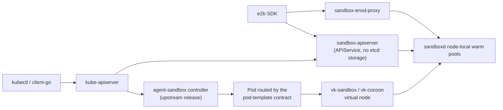

# sandbox-operator

An aggregated Kubernetes apiserver and e2b-compatible data plane for warm-pooled
agent sandboxes. It serves `sandboxes.agents.x-k8s.io` by scatter-gathering
per-node inventory instead of storing a per-sandbox object, so one
`SandboxWarmPool` patch took 20 bare-metal nodes to **50 000 running microVMs in
10–15 s** while etcd saw ~2 writes/s ([methodology](PERFORMANCE.md)).

**Documentation: [cocoonstack.github.io/sandbox-operator](https://cocoonstack.github.io/sandbox-operator/)**

## Architecture

The `Sandbox` API has three serving paths. The first is upstream's; the other
two are this repository.



- **Pod path** — upstream's controller turns a `Sandbox` into a Pod. Routing
  that Pod to a microVM node is an explicit pod-template contract the template
  author writes; see [runtime backends](docs/runtime-backends.md).
- **L3 path** — `sandbox-apiserver` serves `sandboxes.agents.x-k8s.io/v1beta1`
  from `NodeInventory` and claims from a node's warm pool on create. It adds
  pause, resume, fork and snapshot subresources.
- **e2b path** — the same apiserver optionally serves an e2b REST surface, and
  `sandbox-envd-proxy` carries the SDK's `files`, `commands` and `pty` traffic
  into the sandbox.

## Quick start

Install the L3 path on a cluster with sandboxd nodes and cert-manager:

```bash
VERSION=v1.0.3
for crd in extensions.agents.x-k8s.io_sandboxtemplates extensions.agents.x-k8s.io_sandboxwarmpools; do
  kubectl apply -f "https://raw.githubusercontent.com/kubernetes-sigs/agent-sandbox/${VERSION}/k8s/crds/${crd}.yaml"
done

helm upgrade --install sandbox-operator ./helm \
  --namespace sandbox-system --create-namespace \
  --set apiserver.image.tag=<release> --set envdProxy.image.tag=<release>
kubectl -n sandbox-system rollout status deployment/sandbox-apiserver

kubectl apply -f examples/l3/template-warmpool.yaml   # fill the nodes' warm pools
kubectl apply -f examples/l3/sandbox.yaml             # claim one
kubectl get sandboxes
```

The chart brings the warm-pool driver, which needs those two upstream CRDs, and
an `APIService` that deliberately shadows the `Sandbox` CRD for
`agents.x-k8s.io/v1beta1` — so an L3 cluster does not run upstream's controller,
and does not install its `Sandbox` CRD. For the Pod path, apply upstream's
`sandbox-with-extensions.yaml` instead. Both variants, the e2b values and the
full chart reference are in [configuration](docs/configuration.md).

## Related projects

- [agent-sandbox](https://github.com/kubernetes-sigs/agent-sandbox) — the
  `Sandbox` API and the controller serving the Pod path.
- [vk-sandbox](https://github.com/cocoonstack/vk-sandbox) — virtual node that
  serves a sandbox Pod from a node-local sandboxd warm pool.
- [vk-cocoon](https://github.com/cocoonstack/vk-cocoon) — virtual node that
  materializes a Pod as a Cocoon microVM.
- [sandbox](https://github.com/cocoonstack/sandbox) — sandboxd, the node-local
  daemon both the L3 apiserver and the proxy talk to.

## Development

```bash
make build
make test
make lint
make fmt
```

## License

AGPL-3.0 — see [LICENSE](LICENSE). The `agents.x-k8s.io` and
`extensions.agents.x-k8s.io` APIs come from the `sigs.k8s.io/agent-sandbox` Go
module (Apache-2.0) and are consumed as a dependency; no upstream source is
copied into this tree. This repository's own code is AGPL-3.0.
