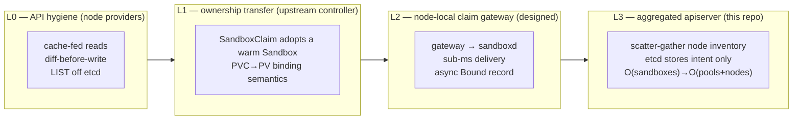

# Scaling design — decentralized sandbox scheduling on Kubernetes semantics

Modal's ["1M concurrent sandboxes"](https://modal.com/blog/scaling-to-1-million-concurrent-sandboxes-in-seconds)
post argues Kubernetes cannot reach that scale: scheduling is `O(n×p)` and
serialized, every Pod causes multiple etcd writes, etcd is not shardable within a
keyspace, and kubelet heartbeats impose an `O(nodes)` write floor. Their answer is
to **leave Kubernetes entirely** — a fleet of stateless schedulers over in-memory
worker state published to a Redis stream, direct scheduler→worker RPC, and *no
datastore on the sandbox-creation critical path*.

Their diagnosis is correct. Their conclusion is not the only option. What Modal
actually removed is a **centralized transaction path**, not API semantics — and
Kubernetes already separates those two things in its own design: kubelet **static
Pods** (the node acts first, the apiserver records after), the **coordination.k8s.io
Lease** (a dedicated tiny object for heartbeats instead of full Node writes), and
the **metrics.k8s.io aggregation layer** (a virtual resource served by
scatter-gathering live node state, with *zero* etcd storage). Our thesis:

> **Keep Kubernetes as the record-of-intent and policy plane; push the
> transaction plane down to the node — behind CRDs, RBAC, and watch, so
> `kubectl get sandboxes` never stops working.**

The staging is four layers. L0 is a property of the node providers. L1 is the
CRD claim path, served by **upstream's agent-sandbox controller** — this
repository no longer implements it. L2 is designed here and not built. L3 is
what this repository ships: the aggregated apiserver with its warm-pool driver
and the `NodeInventory` contract that vk-sandbox publishes into.



### L0 — API hygiene (shipped in the providers)

The prerequisite, delivered in the `vk-cocoon` provider (2026-07-17): every
periodic read is served from a node-scoped informer cache, every write is
diffed first, and no control-loop `LIST` hits etcd (list at `ResourceVersion=0`,
or a field-selected node-local lister). This is the qualifier — without it any
scale test wedges the apiserver first. Measured on an idle virtual-kubelet node
afterward: **0.2 req/s, zero LIST** (lease renew + node-status patch only). The
root cause it fixed: Kubernetes APF prices `LIST` seats by the **total object
count** of the resource, so at 2500 pods even a tiny per-node list goes
max-width and saturates a dedicated priority level — client QPS caps cannot fix
a seat-seconds problem, only removing the lists can.

`vk-sandbox` keeps the same rule: its status reads are served from the
provider's own claim table, and the L3 apiserver and proxy read `NodeInventory`
through an informer rather than listing it per request.

### L1 — claim is ownership transfer, not scheduling (upstream)

A warm claim is not a create. The Pod is already scheduled, bound, image-pulled,
and booted; a `SandboxClaim` only needs to **transfer ownership** of one
pre-warmed `Sandbox` — the exact semantics Kubernetes already ships for
`PersistentVolumeClaim → PersistentVolume` binding (`Phase: Bound`). Nothing on
the claim path needs the scheduler, kubelet bind, or image pull.

That is upstream agent-sandbox's model, and its controller implements it. This
repository used to carry a fork of those controllers; it does not any more, so
the mechanism, its failure modes and its numbers belong upstream. What remains
here for the Pod path is the [pod-template contract](runtime-backends.md) that
decides which node a claimed Pod lands on.

The L1 numbers this repository once published (claim fast-path p50 0.644 ms at
N=100 vs 0.646 ms at N=2000; claim→Bound p50 129 ms on real microVMs) were
measured against the fork's controllers and their `test/scalebench` and
`test/poolbench` harnesses, all of which were deleted with the fork. They are
kept, labelled, in [performance.md](performance.md)
as the historical record, and they are not claims about upstream's controller.

### L2 — node-local claim gateway (designed, not built)

L1 still round-trips the apiserver. L2 would take the claim off the central
path entirely for the runtimes that have a node-local warm pool (`sandboxd`),
while keeping the `SandboxClaim` object as the durable record: a per-node
gateway in front of `sandboxd` hands over an already-running microVM in
**0.2–0.7 ms** and returns connection info immediately, and the `SandboxClaim`
is marked `Bound` **asynchronously** — the record follows the action, exactly
as kubelet static Pods record to the apiserver after the container is already
running. An orphan reconciler adopts a delivery whose record was lost and never
destroys a VM; authorization stays central through a `SubjectAccessReview`
before delivery, and a node with no warm VM answers with an explicit fallback
signal for the L1 path.

This repository carried a reference gateway with a fake-node harness until
`f99c174`; nothing deployed it, so it was cut. The node-local claims that ship
today are the L3 apiserver's `Create` and the vk-sandbox provider's `CreatePod`,
both straight against `sandboxd`.

### L3 — aggregated apiserver: etcd stores intent, not sandboxes (implemented)

A million `Sandbox` objects in etcd is a dead end (churn alone blows the ~8 GB
keyspace). The Kubernetes-native fix is the aggregation layer: serve
`sandboxes.agents.x-k8s.io` from an **aggregated apiserver** (an `APIService`)
that **scatter-gathers** live node inventory on read. etcd stores only *intent* —
one `SandboxWarmPool` spec expressing a million desired replicas, plus one
`inventory` object per node (`O(nodes)`). Object count drops from
`O(sandboxes)` to `O(pools + nodes)`.

Each virtual-kubelet node already knows its own VMs (L0 made that cache the
source of truth), so the aggregated server assembles a `SandboxList` by fanning
out to node inventories — the exact pattern `metrics.k8s.io` uses to serve
`PodMetrics` with zero etcd storage. `kubectl get sandboxes`, RBAC, field
selectors, and `watch` (currently implemented by polling and diffing the
cache-fed `NodeInventory` view) all keep working; users never see that storage
decentralized.

Warm capacity is intent too. The in-process warm-pool driver watches
`SandboxWarmPool`, resolves its `SandboxTemplate` into a `(template, net, size)`
key, spreads the desired replicas across the nodes that advertise a sandboxd
address, and writes the pool's `status.replicas`/`readyReplicas` back from what
those nodes report. The reconcile is `O(pools + nodes)` per tick and never
per-sandbox, which is why the apiserver's background load does not grow with
the sandbox count.

```go
// SandboxStore backs the aggregated apiserver for sandboxes.agents.x-k8s.io.
// It holds NO per-sandbox etcd objects: List/Get/Watch use the cache-fed node
// inventories, and Create/Delete claim or release through a node-local RPC.
type SandboxStore interface {
    List(ctx context.Context, opts ListOptions) (*SandboxList, error)   // fan-out to node inventories
    Get(ctx context.Context, ns, name string) (*Sandbox, error)         // fan-out; materialize only the match
    Watch(ctx context.Context, opts ListOptions) (watch.Interface, error) // poll and diff inventory
}

// NodeInventory is the one O(nodes) etcd object per node: the durable
// summary of that node's live sandboxes, server-side-applied on a slow
// cadence. The per-sandbox truth lives in the node, not etcd.
type NodeInventory struct {
    metav1.TypeMeta   `json:",inline"`
    metav1.ObjectMeta `json:"metadata,omitempty"`
    Node    string           `json:"node"`
    Entries []InventoryEntry `json:"entries"` // {name, id, phase, template, claimRef, addr, deadline, claimedAt}
    Address string           `json:"address"` // the node's sandboxd advertise address
    Pools   []PoolCapacity   `json:"pools"`   // per-pool warm capacity
}
```

`NodeInventory` is this repository's only CRD, in its own group
`sandbox.cocoonstack.io` — deliberately not in `agents.x-k8s.io`, whose entire
v1beta1 the `APIService` hands to the aggregated server, which serves only
`sandboxes`.

**Failure modes**

| Scenario | Behavior | Breaks k8s semantics? |
|---|---|---|
| Node partitioned from aggregated server | Its sandboxes briefly absent from `List` (eventual consistency, same as an informer lag) | No |
| A node `inventory` object lost | Rebuilt from the node's own live state on next publish | No |
| A node's `Node` object deleted | Its `NodeInventory` is garbage-collected with it: the node leaves the claim path and its sandboxes leave the read view, though sandboxd keeps serving them and their leases still expire there; restarting vk-sandbox registers the node again | No |
| Aggregated server restart | Stateless; rebuilds from node fan-out | No |
| Client reads before the owning node republishes inventory | Lookups by name and by claim id (e2b, envd proxy), and a list or watch pinned to one name in a namespace, ask the nodes; other lists and watches show it at the next publish | No — fleet `list` and `watch`, and a deleted sandbox until its node publishes, stay eventually consistent |

**Acceptance:** 1M sandbox *intent* costs `O(nodes)` etcd objects; `kubectl get
sandboxes` returns the fanned-out list; per-sandbox `Get` only materializes the
matching entry, and reads a claim from its node before that node publishes it.

### L3 routing: why node choice is sampled, not maximized

Create schedules off `NodeInventory`, which each node republishes on a
5–30 s cadence. Picking the node with the highest advertised warm count would
therefore send *every* claim in a refresh window to whichever node looked best
in that one snapshot — draining it while its peers stay idle. The repo's own
100-burst run showed the signature: 98/100 warm, and both misses were
cold-provision on a single over-scheduled node.

Node choice is instead power-of-two-choices: sample two candidates that
advertise warm capacity for the requested pool and take the warmer one. That
keeps the bias toward warm capacity while spreading a burst across the fleet,
and a stale pick still costs at most one gossip redirect inside sandboxd, so
correctness is unchanged.

The watch path makes the opposite trade. Re-deriving the fleet view is
`O(nodes × sandboxes)` — measured at 124 ms for the list and 173 ms for a full
poll tick at 200 nodes and 50k sandboxes — yet the poll cadence is fixed on
purpose: a widened interval would let a sandbox created and deleted inside the
gap produce neither an Added nor a Deleted event. One watcher per fleet is the
supported shape.

### L3 read after write without published inventory

Single-sandbox lookup does not build the cluster-wide `SandboxList`.
`SandboxStore.Get` and the e2b claim-id resolver fan out across the cache-fed
per-node inventories, cancel on the first match, and materialize only that
entry. An owning-node index answers a repeat lookup from one node's inventory:
measured at 200 nodes × 2000 sandboxes, `Get` fell from 2.49 ms / 36 MB to
39 µs / 217 KB per call. A first lookup, or one whose index entry was evicted,
still compares entries across the fleet.

A sandbox is live on its node the moment `Claim` returns, but it reaches the
inventory only when that node republishes (default 30 s; measured against a
20-node fleet, `p50` 29.0 s on the e2b surface, 28.6 s through the aggregated
API). Reads do not wait for it:

- **Claim-time index.** The store records the owning node when a claim is made
  and when a sweep resolves one, and consults it before fanning out. It is
  bounded by generation swap rather than per-entry recency bookkeeping, so
  memory is a fixed budget rather than a function of load.
- **Authoritative lookup on a miss.** When the indexed node's inventory lacks
  the entry, the apiserver asks that node with the fleet token before sweeping
  the fleet's inventories, and then asks every node: by claim id with one
  `GET /v1/sandboxes/{id}` each, by name with one
  `GET /v1/sandboxes?claim_ref=<namespace>/<name>` each, which a node answers
  from its own index with only the claims recorded under that ref. A name no
  node holds costs one such request per node, so a client-side `kubectl
  apply`, which reads before it creates, pays it once per new object. The envd
  proxy, which holds no fleet token, asks `GET /v1/sandboxes/{id}/owner` with
  the caller's sandbox token under a per-replica budget and keeps the answer
  for a minute, past the node's next publish. A node that has not answered
  within 500 ms counts as a miss, so a node that is gone while its inventory
  object remains does not hold a lookup up.

Neither touches etcd. **Publishing inventory on change was considered and
rejected:** `NodeInventory` carries one 105 B entry per live sandbox
(measured), so a node holding 2500 of them is a 263 KB object. Re-applying that
on a 2 s debounce costs 52.6 MB/s of large-object server-side-apply traffic
across 400 nodes at 1 M sandboxes, against 3.5 MB/s for the current 30 s
cadence — and it would still leave the `O(total inventory entries)` lookup in
place.

**Acceptance:** a lifecycle verb succeeds on a sandbox claimed milliseconds ago;
resolving one sandbox allocates `O(1)`, not `O(total sandboxes)`; index memory
is capped independently of fleet size.

### How this differs from Modal

Modal buys throughput by leaving Kubernetes: a proprietary SDK and a proprietary
control plane. Every layer here keeps `kubectl` / CRDs / RBAC / the ecosystem
intact. The one-line framing:

> **Modal proved 1M needs a decentralized transaction plane. We show the
> decentralized transaction plane can hide behind Kubernetes semantics.**

| | Modal | this stack |
|---|---|---|
| Scheduling | stateless fleet, in-memory worker state | upstream's leader-elected controller + Lease (L1) |
| Create critical path | direct scheduler→worker RPC, no datastore | ownership transfer (L1) → node-local claim (L3) |
| State of record | Redis stream (async) | Kubernetes objects; node inventory in etcd is `O(nodes)` (L3) |
| Sandbox storage | proprietary | aggregated apiserver, etcd stores intent only (L3) |
| Client interface | proprietary SDK | any Kubernetes client — unchanged |
| Scale ceiling | no practical limit | decoupled from etcd object count at L3 |

### Measured performance

Numbers are labelled by substrate: **algorithmic complexity** is proven on a
fake apiserver or an in-process store (so it isolates the scaling term, not
machine speed), while **absolute latency on real microVMs** is measured on
bare-metal nodes. The harnesses that still live in this repository regenerate
their own evidence; the rows marked *retired* were measured by harnesses this
repository no longer contains: the forked controllers at commit `0719d33`, the
L2 gateway bench at `f99c174`.

| Layer | Acceptance claim | Measured | Substrate / harness |
|---|---|---|---|
| **L2** *(retired)* | sub-millisecond node-local claim | gateway overhead p50 **0.039 ms**, p95 0.053 ms (sandboxd delivery itself is 0.2–0.7 ms by contract); 200/200 orphan bindings reconciled, **0** VM destroys | httptest sandboxd + fake recorder — `test/l2bench`, deleted with the gateway |
| **L3** | etcd stores intent only, `kubectl` unchanged | **3000** sandboxes served through client-go List/Get/Watch from **8** etcd objects (3 nodes + 5 pools) — **0** per-sandbox objects, 3 server-side-apply writes | in-process aggregated apiserver — `test/l3bench` |
| **L3** | one lookup does not scan the fleet twice | `Get` 2.49 ms / 36 MB → **39 µs / 217 KB** with the owning-node index, at 200 nodes × 2000 sandboxes | Go benchmarks — `pkg/scale`, `pkg/e2bcompat` |
| **sandboxd tier (deployed)** | hot-pool warm claim via k8s, apiserver flat under load | 100 `Sandbox` create→Ready **p50 < 1 s** (warm), 98/100, submitted in 2.9 s; **100 %** routed to the sandboxd plane; apiserver LIST 37 ms/7 ms, **0 APF rejections, in-queue 0** | 26-node fleet, `vk-sandbox` + sandboxd |
| **fleet** | one `kubectl patch` supplies a fleet | **50 000** microVMs on 20 nodes in **10–15 s**, at **99 MB net RAM per microVM**, etcd ~2 writes/s across the run | 20 bare-metal nodes, warm-pool driver + sandboxd |
| **L1** *(retired)* | claim p50 flat as the pool grows | fast-path p50 0.644 ms → 0.646 ms from N=100 to N=2000 | fake apiserver + the forked reconciler — harness deleted |
| **L1** *(retired)* | warm claim on real microVMs | claim→Bound p50 129 ms, p95 926 ms; 100/100 warm hits | the microVM node, 100 concurrent claims — harness deleted |

One honest caveat: the retired L2 figure measured gateway overhead on a fake
node; real end-to-end latency additionally pays the apiserver round-trip,
sandboxd delivery (0.2–0.7 ms), and inventory convergence.
